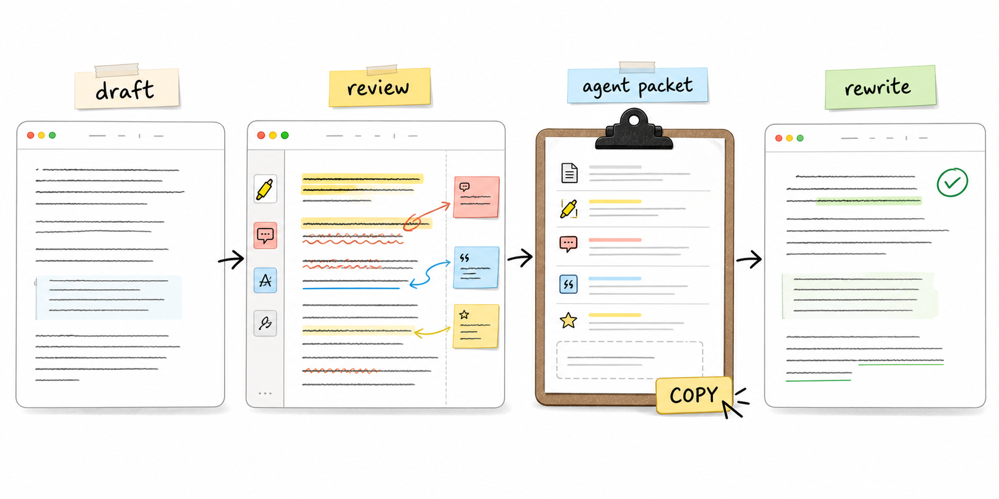
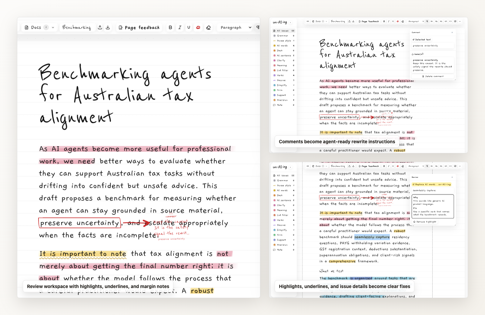

# un-AI-ing

<p align="center">
  
</p>



un-AI-ing is a local writing-review app for turning AI-sounding drafts into clear rewrite instructions. A reviewer marks the draft with highlights, comments, underlines, style references, and rewrite feedback, then copies one structured packet into Codex, Claude Code, Cursor, or another coding/CLI agent.



## What It Does

- Opens an editable document review surface powered by TipTap.
- Scans for AI jargon, em dashes, AI-shaped sentence patterns, meaning drift, passive voice, over-complex sentences, over-explaining, under-explaining, and vague wording.
- Lets reviewers add manual highlights, comments, style references, underlines, and removal marks.
- Imports `.doc`, `.docx`, `.pdf`, `.txt`, `.md`, and `.html` files.
- Tracks saved rewrite versions with better/same/worse feedback.
- Copies one agent-ready report containing the draft, review marks, reviewer comments, style references, rewrite feedback, a rewrite brief, and style-repair instructions.

## Quick Start

Install the app dependencies:

```bash
npm install
```

Start the local app:

```bash
npm start
```

Open the local URL Vite prints in the terminal, usually [http://127.0.0.1:5173](http://127.0.0.1:5173).

## Using It With Coding Or CLI Agents

1. Open or paste a draft into un-AI-ing.
2. Highlight text that sounds generic, risky, vague, or off-style.
3. Add comments where the agent needs context.
4. Add style references when a selected passage should borrow rhythm or structure from another paragraph.
5. Click the copy button in the toolbar.
6. Paste the copied report into Codex, Claude Code, Cursor, or another CLI agent and ask it to rewrite the draft from that packet.

The copied report tells the agent what to preserve, what to change, which facts matter, and how to avoid copying style-reference content.
